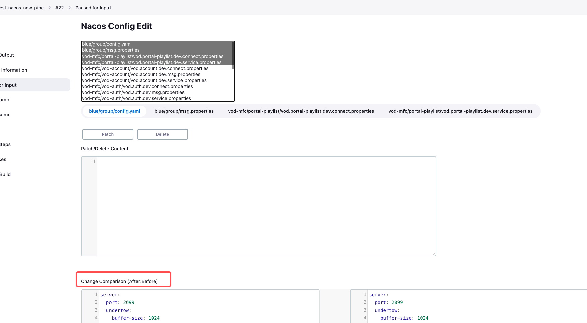
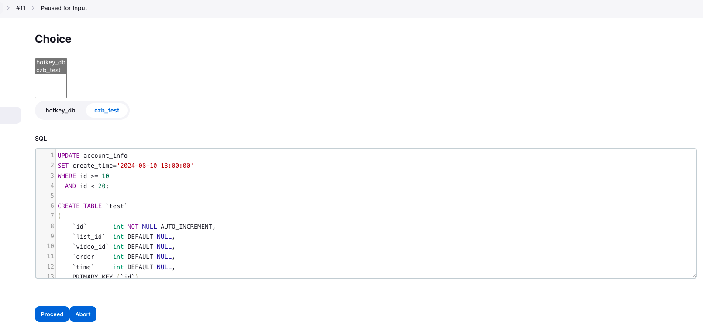

# Jenkins ConfigOps Plugin

## 介绍

配合 [ConfigOps](https://github.com/dumasd/config-ops) 执行配置变更。

## 开始使用

### ConfigOps 部署

在 Jenkins Agent 机器上部署 ConfigOps 服务，文档参考：[config-ops/README.md](https://github.com/dumasd/config-ops)

### Nacos 配置变更

1. nacosConfigsGet (Jenkins Step) 获取指定namespace列表下所有的配置

``` groovy
def nacosConfigs = nacosConfigsGet(toolUrl: 'http://127.0.0.1:5000', nacosId: 'default', namespaces: ['vod-mfc', 'blue'])    
```

#### 输入参数

| 参数         | 类似             | 参数解释                  | 必填                            |
|------------|----------------|-----------------------|-------------------------------|
| toolUrl    | Config Ops URL | Config Ops 服务地址       | N，不填默认为 http://127.0.0.1:5000 |
| nacosId    | Nacos ID       | Config Ops Nacos 配置ID | Y                             |
| namespaces | Namespaces     | Nacos 命名空间ID列表        | Y                             |

#### 输出参数

| 参数        | 类型       | 参数解释         |
|-----------|----------|--------------|
|           | object[] | 配置列表         |
| - id      | string   | 配置ID         |
| - dataId  | string   | Data ID      |
| - group   | string   | Group        |
| - content | string   | 当前内容         |
| - tenant  | string   | Namespace ID |
| - type    | string   | 配置格式         |

2. nacosConfigAlter (Jenkins Parameter) Nacos配置修改界面

```groovy
// 传入上一步获取到的配置列表，弹出界面进行配置修改
def alterResult = input(message: 'Nacos Config Edit', parameters: [nacosConfigAlter(items: nacosConfigs)])
```



#### 输入参数

| 参数    | 类似       | 参数解释      | 必填 |
|-------|----------|-----------|----|
| items | object[] | Nacos配置列表 | Y  |

#### 输出参数

| 参数            | 类型       | 参数解释         |
|---------------|----------|--------------|
| values        | object[] | 配置列表         |
| - namespace   | string   | Namespace ID |
| - dataId      | string   | Data ID      |
| - group       | string   | Group        |
| - format      | string   | 配置格式         |
| - content     | string   | 当前内容         |
| - nextContent | string   | 修改后内容        |

3. nacosConfigModifyApply (Jenkins Step) 应用修改后的配置

``` groovy
nacosConfigModifyApply(toolUrl: 'http://127.0.0.1:5000', nacosId: 'default', items: alterResult['values'])
```

#### 输入参数

| 参数      | 类似             | 参数解释                  | 必填                            |
|---------|----------------|-----------------------|-------------------------------|
| toolUrl | Config Ops URL | Config Ops 服务地址       | N，不填默认为 http://127.0.0.1:5000 |
| nacosId | Nacos ID       | Config Ops Nacos 配置ID | Y                             |
| items   | object[]       | 上一步修改后的配置列表           | Y                             |

完整示例

``` groovy
pipeline {
    agent {
        label 'test'
    }

    stages {
        stage('Hello') {
            steps {
                script {
                    def nacosConfigs = nacosConfigsGet(nacosId: 'default', namespaces: ['vod-mfc', 'blue'])    
                    def alterResult = input(message: 'Nacos Config Edit', parameters: [nacosConfigAlter(items: nacosConfigs)])
                    nacosConfigModifyApply(nacosId: "default", items: alterResult['values'])
                }
            }
        }
    }
}

```

### 数据库脚本执行

1. databaseSqlEdit (Jenkins Parameter) 数据库SQL脚本编辑界面

```groovy
def editResult = input(message: 'Choice', parameters: [databaseSqlEdit(dbs: ["hotkey_db", "czb_test"])])
```

#### 输入参数

| 参数  | 类似       | 参数解释    | 必填 |
|-----|----------|---------|----|
| dbs | string[] | 数据库名称列表 | Y  |

#### 输出参数

| 参数         | 类型       | 参数解释    |
|------------|----------|---------|
| values     | object[] | 数据库脚本列表 |
| - database | string   | 数据库名称   |
| - sql      | string   | SQL脚本   |



2. databaseSqlApply (Jenkins Step) 执行数据库脚本

```groovy
databaseSqlApply(toolUrl: 'http://127.0.0.1:5000', databaseId: 'vod-dev', items: editResult['values'])
```

#### 输入参数

| 参数         | 类似             | 参数解释                     | 必填                            |
|------------|----------------|--------------------------|-------------------------------|
| toolUrl    | Config Ops URL | Config Ops 服务地址          | N，不填默认为 http://127.0.0.1:5000 |
| databaseId | Nacos ID       | Config Ops Database 配置ID | Y                             |
| items      | object[]       | 上一步的数据库脚本列表              | Y                             |

完整示例

```groovy
pipeline {
    agent {
        label 'test'
    }

    stages {
        stage('Execute') {
            steps {
                script {
                    def editResult = input(message: 'Choice', parameters: [databaseSqlEdit(dbs: ["hotkey_db", "czb_test"])])
                    databaseSqlApply(toolUrl: 'http://127.0.0.1:5000', databaseId: 'vod-dev', items: editResult['values'])
                }
            }
        }
    }
}
```

## LICENSE

Licensed under MIT, see [LICENSE](LICENSE.md)

